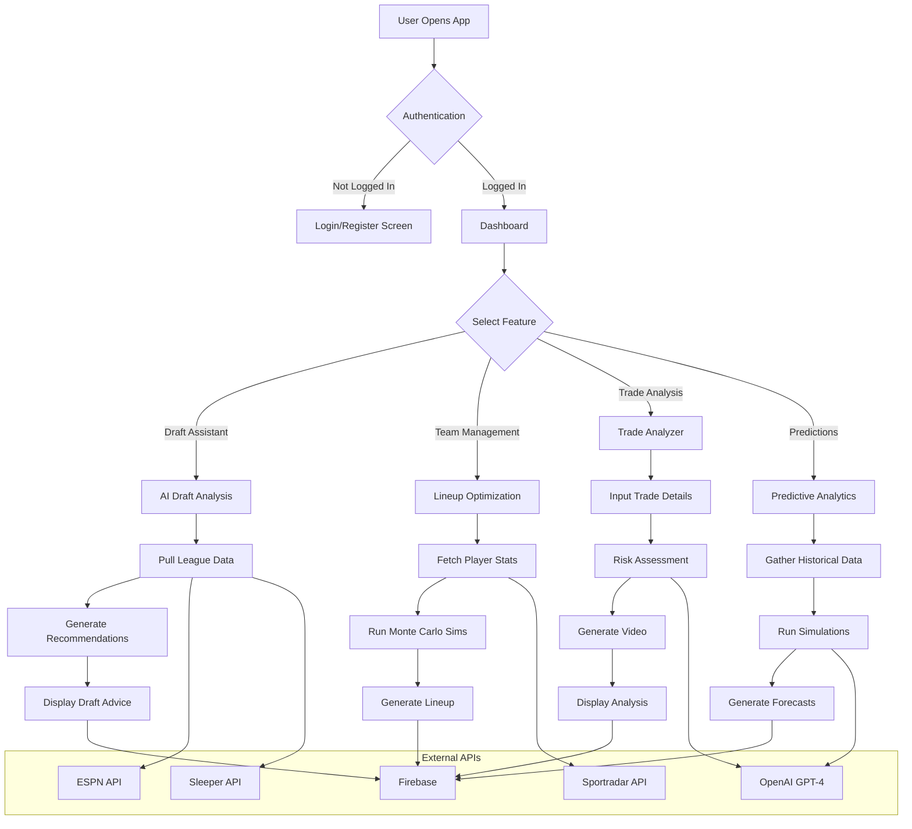
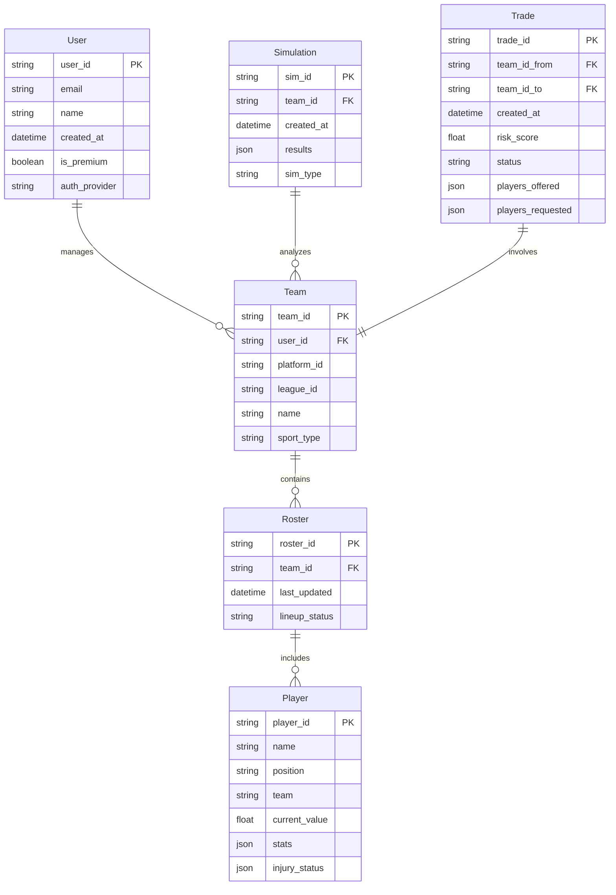
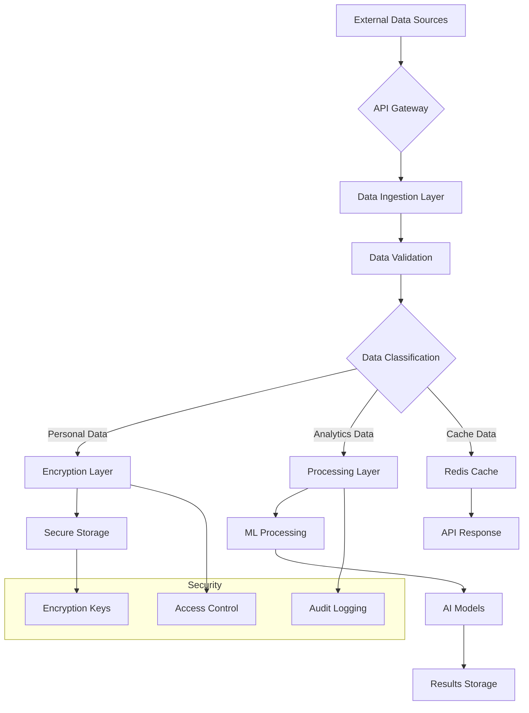

# Product Requirements Document (PRD)

# 1. INTRODUCTION

## 1.1 Purpose
This Software Requirements Specification (SRS) document provides a comprehensive description of the AI-Powered Fantasy Sports GM Assistant mobile application. It is intended for:
- Development team members implementing the system
- Project stakeholders and investors
- Quality assurance teams conducting testing
- Future maintainers of the system
- Integration partners (ESPN, Sleeper)

## 1.2 Scope
The AI-Powered Fantasy Sports GM Assistant is a mobile application that enhances fantasy sports management through artificial intelligence. The system will:

- Provide AI-driven draft recommendations and team management advice
- Generate predictive simulations for season outcomes and player performance
- Offer real-time lineup optimization based on multiple data points
- Deliver AI-generated video breakdowns and trade analysis
- Integrate with existing fantasy platforms via APIs
- Support multiple sports leagues (NFL, NBA, MLB)

Key Benefits:
- Reduces time spent analyzing fantasy sports data
- Improves decision-making through AI-powered insights
- Increases engagement through interactive features
- Provides competitive advantage through predictive analytics

Core Functionalities:
1. Predictive Simulations
   - Monte Carlo simulations for season outcomes
   - Player performance projections
   - Weather and injury impact analysis

2. Lineup Optimization
   - Real-time start/sit recommendations
   - Matchup-based analysis
   - Automated roster adjustments

3. Trade Analysis
   - Risk assessment scoring
   - AI-generated video breakdowns
   - Performance impact projections

4. Platform Integration
   - ESPN/Sleeper API connectivity
   - Real-time data synchronization
   - Cross-platform compatibility

# 2. PRODUCT DESCRIPTION

## 2.1 Product Perspective
The AI-Powered Fantasy Sports GM Assistant operates as a mobile application that integrates with existing fantasy sports platforms while maintaining its own independent functionality. The system architecture consists of:

- Mobile client (React Native + Expo) for iOS and Android platforms
- Backend services (Python FastAPI) hosted on AWS EC2
- Firebase Firestore for real-time data storage
- Integration points with:
  - ESPN/Sleeper APIs for league data
  - Sportradar API for live sports statistics
  - OpenAI GPT-4 for AI-driven analysis
  - Eleven Labs and RunwayML for video content generation

## 2.2 Product Functions
The system provides the following core functions:

1. AI-Powered Draft Assistance
   - Real-time draft recommendations
   - Player value projections
   - Draft strategy optimization

2. Team Management
   - Lineup optimization
   - Roster analysis
   - Injury impact assessment
   - Weather condition analysis

3. Trade Analysis System
   - Risk assessment scoring (1-100 scale)
   - AI-generated video breakdowns
   - Performance impact projections
   - Trade simulation scenarios

4. Predictive Analytics
   - Monte Carlo season simulations
   - Player performance forecasting
   - Playoff odds calculations
   - League outcome predictions

## 2.3 User Characteristics
Primary user personas include:

1. Casual Fantasy Player
   - Limited time for research
   - Basic sports knowledge
   - Seeks automated assistance
   - Mobile-first user

2. Competitive Fantasy Manager
   - Deep sports knowledge
   - Data-driven decision maker
   - Requires detailed analytics
   - Uses multiple platforms

3. Daily Fantasy Sports (DFS) Player
   - Frequent engagement
   - Requires real-time updates
   - Values quick decision making
   - Highly analytical approach

## 2.4 Constraints

Technical Constraints:
- API rate limits (Sportradar: 500 calls/minute)
- GPT-4 response time (2-3 seconds average)
- Mobile device storage limitations
- Real-time data synchronization delays

Business Constraints:
- $9,500 initial development budget
- 3-month development timeline
- $9.99/month price point requirement
- Free tier functionality restrictions

Legal Constraints:
- GDPR and CCPA compliance requirements
- COPPA compliance (18+ age restriction)
- Fantasy sports regulations by state
- Data privacy requirements

## 2.5 Assumptions and Dependencies

Assumptions:
- Users have consistent internet connectivity
- Target devices support React Native requirements
- Users maintain active fantasy sports league memberships
- Sports leagues operate on normal schedules

Dependencies:
- ESPN/Sleeper API availability and stability
- Sportradar API service continuity
- OpenAI API service reliability
- Firebase service availability
- AWS infrastructure uptime
- Third-party payment processing systems
- Sports league data feeds

# 3. PROCESS FLOWCHART



# 4. FUNCTIONAL REQUIREMENTS

## 4.1 AI-Powered Draft Assistant

### ID: F-001
### Description
Real-time AI-driven draft recommendations and analysis system that helps users make optimal draft picks based on multiple data points.
### Priority: HIGH
### Requirements

| ID | Requirement | Priority |
|---|---|---|
| F-001.1 | System shall analyze player statistics using Sportradar API in real-time during drafts | HIGH |
| F-001.2 | System shall generate draft recommendations within 2 seconds using GPT-4 | HIGH |
| F-001.3 | System shall display player value projections on a 1-100 scale | MEDIUM |
| F-001.4 | System shall provide alternative pick suggestions if primary recommendation is drafted | HIGH |
| F-001.5 | System shall track draft history and adjust strategy accordingly | MEDIUM |
| F-001.6 | System shall integrate with ESPN and Sleeper draft lobbies via API | HIGH |

## 4.2 Team Management System

### ID: F-002
### Description
AI-powered lineup optimization and roster analysis system that provides daily management recommendations.
### Priority: HIGH
### Requirements

| ID | Requirement | Priority |
|---|---|---|
| F-002.1 | System shall optimize lineups daily using Monte Carlo simulations | HIGH |
| F-002.2 | System shall monitor and alert users of injuries via Firebase notifications | HIGH |
| F-002.3 | System shall analyze weather impacts on player performance | MEDIUM |
| F-002.4 | System shall provide start/sit recommendations with confidence scores | HIGH |
| F-002.5 | System shall support drag-and-drop lineup adjustments | LOW |
| F-002.6 | System shall sync roster changes back to fantasy platforms | HIGH |

## 4.3 Trade Analysis System

### ID: F-003
### Description
Comprehensive trade analysis tool that generates risk assessments and AI-powered video breakdowns.
### Priority: MEDIUM
### Requirements

| ID | Requirement | Priority |
|---|---|---|
| F-003.1 | System shall calculate trade risk scores using GPT-4 analysis | HIGH |
| F-003.2 | System shall generate video breakdowns using Eleven Labs and RunwayML | MEDIUM |
| F-003.3 | System shall simulate post-trade team performance | HIGH |
| F-003.4 | System shall provide counter-trade suggestions | MEDIUM |
| F-003.5 | System shall track league-wide trade patterns | LOW |
| F-003.6 | System shall export trade analysis reports | LOW |

## 4.4 Predictive Analytics Engine

### ID: F-004
### Description
Advanced simulation system that forecasts season outcomes and player performance.
### Priority: HIGH
### Requirements

| ID | Requirement | Priority |
|---|---|---|
| F-004.1 | System shall run 1,000 season simulations using Python-based modeling | HIGH |
| F-004.2 | System shall calculate playoff odds with weekly updates | HIGH |
| F-004.3 | System shall predict player performance trends | MEDIUM |
| F-004.4 | System shall generate narrative summaries using GPT-4 | MEDIUM |
| F-004.5 | System shall visualize simulation results with interactive graphs | LOW |
| F-004.6 | System shall export prediction data to CSV format | LOW |

## 4.5 Platform Integration System

### ID: F-005
### Description
Integration framework that connects with external fantasy platforms and data sources.
### Priority: HIGH
### Requirements

| ID | Requirement | Priority |
|---|---|---|
| F-005.1 | System shall authenticate with ESPN and Sleeper APIs | HIGH |
| F-005.2 | System shall maintain real-time data sync with Sportradar API | HIGH |
| F-005.3 | System shall handle API rate limiting and caching | HIGH |
| F-005.4 | System shall implement fallback data sources | MEDIUM |
| F-005.5 | System shall log API interaction metrics | LOW |
| F-005.6 | System shall support multiple fantasy platform versions | MEDIUM |

# 5. NON-FUNCTIONAL REQUIREMENTS

## 5.1 Performance Requirements

| ID | Requirement | Target Metric |
|---|---|---|
| P-001 | API response time for draft recommendations | ≤ 2 seconds |
| P-002 | Monte Carlo simulation processing time | ≤ 5 seconds for 1,000 simulations |
| P-003 | Mobile app launch time | ≤ 3 seconds |
| P-004 | Real-time data sync latency | ≤ 500ms |
| P-005 | Maximum concurrent users supported | 10,000 users |
| P-006 | Client-side memory usage | ≤ 200MB |
| P-007 | Backend CPU utilization | ≤ 70% under peak load |
| P-008 | Database query response time | ≤ 100ms |

## 5.2 Safety Requirements

| ID | Requirement | Description |
|---|---|---|
| S-001 | Data Backup | Automated hourly backups with 30-day retention |
| S-002 | Failure Recovery | System recovery time ≤ 10 minutes |
| S-003 | Data Redundancy | Geographic redundancy across 3 AWS regions |
| S-004 | Error Handling | Graceful degradation of AI features if GPT-4 fails |
| S-005 | State Management | Auto-save of draft and trade analysis progress |
| S-006 | API Fallback | Secondary data sources for Sportradar API failure |

## 5.3 Security Requirements

| ID | Requirement | Implementation |
|---|---|---|
| SE-001 | User Authentication | Firebase Auth with MFA support |
| SE-002 | Data Encryption | AES-256 for data at rest, TLS 1.3 in transit |
| SE-003 | API Security | OAuth 2.0 with JWT tokens |
| SE-004 | Rate Limiting | 100 requests/minute per user |
| SE-005 | Data Privacy | PII encryption and user data isolation |
| SE-006 | Access Control | Role-based access control (RBAC) |
| SE-007 | Audit Logging | All security events logged with timestamps |
| SE-008 | Session Management | 30-minute timeout, secure cookie handling |

## 5.4 Quality Requirements

### 5.4.1 Availability
- System uptime: 99.9% (excluding planned maintenance)
- Planned maintenance: Maximum 4 hours/month during off-peak
- Disaster recovery time: ≤ 1 hour

### 5.4.2 Maintainability
- Code coverage: Minimum 80%
- Documentation: Updated within 24 hours of changes
- Technical debt: Maximum 10% of development time
- Modular architecture with clear separation of concerns

### 5.4.3 Usability
- Mobile-first responsive design
- Maximum 3 clicks to reach any feature
- Support for iOS 14+ and Android 9+
- Offline functionality for core features
- Accessibility compliance with WCAG 2.1 Level AA

### 5.4.4 Scalability
- Horizontal scaling up to 100,000 users
- Auto-scaling based on 70% resource utilization
- Database sharding support above 1TB
- CDN implementation for static assets

### 5.4.5 Reliability
- Mean Time Between Failures (MTBF): ≥ 720 hours
- Mean Time To Recovery (MTTR): ≤ 30 minutes
- Error rate: ≤ 0.1% of all requests
- Data consistency check every 6 hours

## 5.5 Compliance Requirements

| ID | Requirement | Standard |
|---|---|---|
| C-001 | Data Protection | GDPR, CCPA compliance |
| C-002 | Age Verification | COPPA compliance (18+ users) |
| C-003 | Accessibility | WCAG 2.1 Level AA |
| C-004 | Financial Processing | PCI DSS compliance for payments |
| C-005 | Data Retention | 30-day user data retention policy |
| C-006 | Terms of Service | Clear display and user acceptance |
| C-007 | Privacy Policy | Updated quarterly with user notification |
| C-008 | API Usage | Compliance with platform API terms |

# 6. DATA REQUIREMENTS

## 6.1 Data Models



## 6.2 Data Storage

### 6.2.1 Primary Storage
- Firebase Firestore for user data, teams, rosters, and real-time game data
- AWS S3 for AI-generated video content and analysis reports
- Redis cache for frequently accessed data and API responses

### 6.2.2 Data Retention
| Data Type | Retention Period | Storage Location |
|-----------|------------------|------------------|
| User Profiles | Indefinite | Firestore |
| Team/Roster Data | Current season + 1 year | Firestore |
| Simulation Results | 30 days | Firestore |
| Trade Analysis | 90 days | Firestore |
| AI Videos | 7 days | S3 |
| API Cache | 1 hour | Redis |

### 6.2.3 Backup Strategy
- Hourly incremental backups of Firestore data to AWS S3
- Daily full backups of all databases
- Cross-region replication for disaster recovery
- 30-day backup retention with point-in-time recovery

## 6.3 Data Processing



### 6.3.1 Data Security
| Security Layer | Implementation |
|----------------|----------------|
| Encryption at Rest | AES-256 encryption |
| Encryption in Transit | TLS 1.3 |
| Access Control | Firebase Auth + Custom RBAC |
| API Security | JWT tokens with 1-hour expiry |
| Data Masking | PII redaction in logs |
| Audit Trail | All data access logged |

### 6.3.2 Data Processing Requirements
| Process Type | Max Processing Time | Update Frequency |
|--------------|---------------------|------------------|
| Player Stats | 5 seconds | Every 60 seconds |
| Trade Analysis | 10 seconds | On-demand |
| Simulations | 30 seconds | Every 6 hours |
| Lineup Optimization | 3 seconds | Every 15 minutes |
| Video Generation | 60 seconds | On-demand |

### 6.3.3 Data Integration Points
| Integration | Data Type | Frequency | Rate Limit |
|-------------|-----------|-----------|------------|
| Sportradar | Player Stats | Real-time | 500/minute |
| ESPN API | League Data | 5 minutes | 1000/day |
| Sleeper API | Team Data | 1 minute | 100/minute |
| OpenAI | Analysis Data | On-demand | 10000/day |
| Firebase | User Data | Real-time | Unlimited |

# 7. EXTERNAL INTERFACES

## 7.1 User Interfaces

### 7.1.1 Mobile Application Interface

| Screen | Components | Requirements |
|--------|------------|--------------|
| Onboarding | - Welcome screen with AI animation<br>- Sport selection<br>- Platform connection | - Support dark mode (#1A1A1A)<br>- Neon green (#00FF88) accents<br>- Inter font family<br>- Responsive layout (iOS/Android) |
| Dashboard | - Real-time alerts banner<br>- Quick action buttons<br>- Stats overview<br>- Mini schedule | - Maximum 3 clicks to any feature<br>- Pull-to-refresh functionality<br>- Offline mode support |
| Lineup Optimizer | - Drag-drop roster slots<br>- Player rankings<br>- AI explanation buttons | - Real-time updates<br>- Visual feedback on changes<br>- Haptic feedback support |
| Trade Analyzer | - Player search<br>- Risk score display<br>- Video preview<br>- Simulation CTA | - Autocomplete search<br>- Video thumbnail caching<br>- Progress indicators |
| Simulations | - Probability graphs<br>- Narrative summaries<br>- Share buttons | - Interactive charts<br>- Export functionality<br>- Social sharing integration |

### 7.1.2 Accessibility Requirements
- WCAG 2.1 Level AA compliance
- VoiceOver/TalkBack support
- Minimum touch target size: 44x44 points
- Color contrast ratio: 4.5:1 minimum

## 7.2 Hardware Interfaces

### 7.2.1 Mobile Device Requirements

| Component | Specification |
|-----------|--------------|
| iOS | iPhone 6S or newer running iOS 14+ |
| Android | Android 9.0+ with 3GB RAM minimum |
| Storage | 200MB minimum free space |
| Network | 4G LTE or WiFi connection |
| Camera | Required for QR code scanning |
| GPS | Optional for location-based features |

### 7.2.2 Server Hardware Requirements

| Component | Specification |
|-----------|--------------|
| CPU | AWS EC2 t3.large (2 vCPU) |
| Memory | 8GB RAM minimum |
| Storage | 100GB SSD |
| Network | 1Gbps connection |

## 7.3 Software Interfaces

### 7.3.1 External API Integration

| Interface | Protocol | Data Format | Rate Limits |
|-----------|----------|-------------|-------------|
| ESPN API | REST | JSON | 1000 requests/day |
| Sleeper API | REST | JSON | 100 requests/minute |
| Sportradar API | REST | JSON | 500 requests/minute |
| OpenAI GPT-4 | REST | JSON | 10000 requests/day |
| Firebase | WebSocket | JSON | Unlimited |
| Eleven Labs | REST | JSON/Audio | 100 requests/hour |
| RunwayML | REST | JSON/Video | 50 requests/hour |

### 7.3.2 Database Interfaces

| System | Purpose | Protocol |
|--------|----------|----------|
| Firebase Firestore | Primary data storage | HTTPS/gRPC |
| Redis | Caching layer | Redis protocol |
| AWS S3 | Media storage | HTTPS |

## 7.4 Communication Interfaces

### 7.4.1 Network Protocols

| Protocol | Usage | Port |
|----------|-------|------|
| HTTPS | API communication | 443 |
| WebSocket | Real-time updates | 443 |
| gRPC | Firebase communication | 443 |

### 7.4.2 Data Exchange Formats

```json
{
  "player_update": {
    "id": "string",
    "name": "string",
    "stats": {
      "points": "number",
      "status": "string"
    },
    "timestamp": "ISO8601"
  }
}
```

### 7.4.3 Communication Security

| Security Layer | Implementation |
|----------------|----------------|
| Authentication | JWT tokens |
| Transport | TLS 1.3 |
| API Gateway | AWS API Gateway |
| Rate Limiting | Per-user token bucket |
| Encryption | AES-256 for payload |

# 8. APPENDICES

## 8.1 GLOSSARY

| Term | Definition |
|------|------------|
| Monte Carlo Simulation | Statistical technique using repeated random sampling to obtain numerical results and predict probability distributions |
| Daily Fantasy Sports (DFS) | A variant of fantasy sports where contests last for a single day or week rather than an entire season |
| Lineup Optimization | Process of selecting the best possible combination of players for a fantasy sports roster based on various metrics |
| Risk Score | A numerical value between 1-100 indicating the potential risk level of a fantasy sports transaction |
| Trade Analysis | Comprehensive evaluation of a proposed player exchange between fantasy teams |
| Platform Integration | The connection and data synchronization between the app and external fantasy sports platforms |

## 8.2 ACRONYMS

| Acronym | Definition |
|---------|------------|
| API | Application Programming Interface |
| AWS | Amazon Web Services |
| CCPA | California Consumer Privacy Act |
| CDN | Content Delivery Network |
| COPPA | Children's Online Privacy Protection Act |
| CPU | Central Processing Unit |
| CSV | Comma-Separated Values |
| DFS | Daily Fantasy Sports |
| EC2 | Elastic Compute Cloud |
| GDPR | General Data Protection Regulation |
| GPS | Global Positioning System |
| JWT | JSON Web Token |
| MFA | Multi-Factor Authentication |
| MLB | Major League Baseball |
| NBA | National Basketball Association |
| NFL | National Football League |
| PCI DSS | Payment Card Industry Data Security Standard |
| PII | Personally Identifiable Information |
| RBAC | Role-Based Access Control |
| S3 | Simple Storage Service |
| SRS | Software Requirements Specification |
| TLS | Transport Layer Security |
| UI | User Interface |
| WCAG | Web Content Accessibility Guidelines |

## 8.3 ADDITIONAL REFERENCES

### 8.3.1 Technical Documentation
- React Native Documentation: https://reactnative.dev/docs
- FastAPI Documentation: https://fastapi.tiangolo.com/
- Firebase Documentation: https://firebase.google.com/docs
- AWS Services Documentation: https://docs.aws.amazon.com
- Sportradar API Documentation: https://developer.sportradar.com/docs

### 8.3.2 Industry Standards
- Fantasy Sports Trade Association Guidelines
- OpenAPI Specification 3.0
- REST API Design Best Practices
- OAuth 2.0 Security Framework
- Material Design Guidelines

### 8.3.3 Research Papers
- "Predictive Analytics in Fantasy Sports" - Sports Analytics Quarterly
- "Machine Learning Applications in Sports Betting" - MIT Sports Conference
- "Real-time Data Processing for Fantasy Sports" - IEEE Sports Technology Journal

### 8.3.4 Development Tools
- Expo Development Environment
- Firebase Console
- AWS Management Console
- Postman API Testing Suite
- GitHub Repository Management

### 8.3.5 Third-Party Services
- Eleven Labs Voice Generation Platform
- RunwayML Video Generation Service
- OpenAI GPT-4 API Documentation
- Stripe Payment Processing
- Redis Cache Documentation