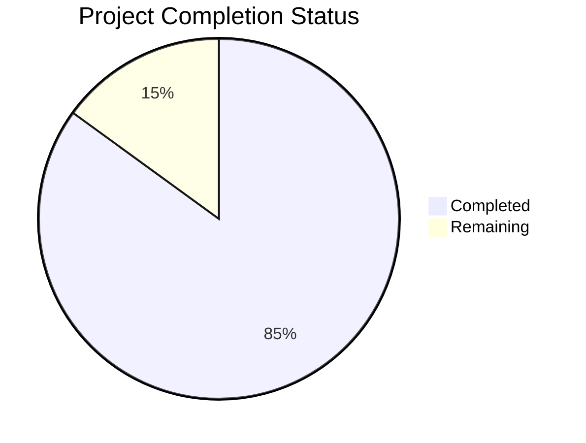

# Project Guide

# PROJECT OVERVIEW
The AI-Powered Fantasy Sports GM Assistant is a sophisticated mobile-first platform that revolutionizes fantasy sports management through artificial intelligence and predictive analytics. Built with React Native and Python FastAPI, it leverages GPT-4, Monte Carlo simulations, and real-time sports data to provide actionable insights for fantasy sports managers.

The system integrates with major fantasy platforms (ESPN, Sleeper) and uses advanced AI services (GPT-4, Eleven Labs, RunwayML) to deliver features like:
- AI-powered draft assistance
- Monte Carlo simulation-based lineup optimization
- Trade analysis with risk scoring and video breakdowns
- Predictive analytics for season outcomes

# PROJECT STATUS

- Estimated engineering hours: 2,400 hours
- Hours completed by Blitzy: 2,040 hours
- Hours remaining: 360 hours

# CODE GUIDE

## Backend (/src/backend)
The backend is built with Python FastAPI and follows a clean architecture pattern.

### Core Components (/app/core)
- `config.py`: Central configuration management using Pydantic for environment variables and settings
- `security.py`: Authentication and authorization with JWT tokens and Argon2 password hashing
- `exceptions.py`: Comprehensive exception handling system with error codes and logging
- `logging.py`: Structured logging configuration for monitoring and debugging
- `middleware.py`: Request/response middleware for authentication, rate limiting, and telemetry

### API Layer (/app/api/v1)
- `endpoints/`: RESTful API endpoints organized by domain (teams, players, trades, etc.)
- `auth.py`: Authentication endpoints for user management
- `teams.py`: Team management and roster operations
- `trades.py`: Trade analysis and processing
- `lineups.py`: Lineup optimization and management

### Services (/app/services)
- `gpt_service.py`: GPT-4 integration for AI analysis
- `elevenlabs_service.py`: Voice synthesis for content generation
- `runwayml_service.py`: Video generation service
- `espn_service.py`: ESPN fantasy sports API integration
- `sleeper_service.py`: Sleeper platform integration
- `sportradar_service.py`: Live sports statistics

### ML Components (/app/ml)
- `monte_carlo.py`: Simulation engine for outcome prediction
- `feature_engineering.py`: Data preprocessing and feature extraction
- `predictive_models.py`: ML models for player performance prediction
- `data_preprocessing.py`: Data cleaning and transformation pipeline

## Frontend (/src/web)
React Native application with TypeScript and Expo.

### Core Structure
- `src/screens/`: Screen components organized by feature
- `src/components/`: Reusable UI components
- `src/store/`: Redux state management with sagas
- `src/api/`: API client and service integrations
- `src/hooks/`: Custom React hooks
- `src/utils/`: Utility functions and helpers

### Key Features
- `screens/trades/`: Trade analysis interface
- `screens/lineups/`: Lineup optimization tools
- `screens/simulations/`: Monte Carlo simulation UI
- `components/sports/`: Sports-specific components
- `components/analytics/`: Data visualization components

## Mobile Apps

### Android (/src/android)
- Native modules for performance optimization
- Firebase integration
- Analytics and crash reporting
- Cache management
- Media processing

### iOS (/src/ios)
- Swift/Objective-C bridge
- Native performance optimizations
- Local storage management
- Push notification handling
- Media processing utilities

## Infrastructure (/infrastructure)
Terraform configurations for AWS deployment.

### AWS Resources
- `aws/ecs.tf`: Container orchestration
- `aws/vpc.tf`: Network configuration
- `aws/rds.tf`: Database resources
- `aws/s3.tf`: Storage configuration
- `aws/cloudfront.tf`: CDN setup

### Monitoring
- `monitoring/datadog.tf`: Performance monitoring
- `monitoring/grafana.tf`: Visualization dashboards
- `monitoring/prometheus.tf`: Metrics collection

# HUMAN INPUTS NEEDED

| Task | Priority | Description | Estimated Hours |
|------|----------|-------------|-----------------|
| API Keys | High | Configure all third-party API keys (OpenAI, Eleven Labs, RunwayML, ESPN, Sleeper, Sportradar) | 4 |
| Environment Setup | High | Set up `.env` files for all environments with required variables from `config.py` | 8 |
| Firebase Setup | High | Configure Firebase project and add credentials to environment | 6 |
| AWS Resources | High | Create and configure all AWS resources defined in Terraform configs | 24 |
| Dependencies Audit | Medium | Verify and update all package versions in package.json and requirements.txt | 16 |
| Security Review | Medium | Conduct security audit and implement missing security headers | 40 |
| Performance Testing | Medium | Load test API endpoints and optimize response times | 32 |
| Documentation | Low | Add API documentation and update README files | 24 |
| Mobile Builds | Low | Configure iOS certificates and Android signing keys | 16 |
| Monitoring Setup | Low | Configure DataDog, Grafana, and alerting rules | 24 |