# Technical Specifications

# 1. INTRODUCTION

## 1.1 EXECUTIVE SUMMARY

The AI-Powered Fantasy Sports GM Assistant is a mobile-first platform that revolutionizes fantasy sports management through artificial intelligence and predictive analytics. The system addresses the critical challenge faced by fantasy sports players who struggle to process vast amounts of data for optimal decision-making. By leveraging GPT-4, Monte Carlo simulations, and real-time sports data, the platform provides actionable insights for drafting, trades, and lineup optimization.

Primary stakeholders include casual and competitive fantasy sports managers across NFL, NBA, and MLB leagues, with an initial target market of 100,000 active users. The platform expects to deliver 30% improved win rates for premium users while reducing team management time by 70%.

## 1.2 SYSTEM OVERVIEW

### Project Context

| Aspect | Details |
| --- | --- |
| Market Position | First-to-market AI-powered fantasy sports assistant with video generation |
| Current Limitations | Manual data analysis, delayed decision-making, fragmented information sources |
| Enterprise Integration | Direct API connections with ESPN, Sleeper, and Sportradar platforms |

### High-Level Description

| Component | Implementation |
| --- | --- |
| Frontend | React Native + Expo mobile application |
| Backend | Python FastAPI on AWS EC2 |
| Database | Firebase Firestore for real-time data |
| AI Processing | GPT-4 Turbo with 128k context window |
| Media Generation | Eleven Labs + RunwayML integration |

### Success Criteria

| KPI | Target Metric |
| --- | --- |
| User Adoption | 100,000 active users within 6 months |
| Premium Conversion | 15% free-to-premium conversion rate |
| User Engagement | 80% weekly active user retention |
| Performance | 95% of AI recommendations delivered in \<2 seconds |

## 1.3 SCOPE

### In-Scope Elements

Core Features:

- AI-powered draft assistance and real-time recommendations
- Monte Carlo simulation-based lineup optimization
- Trade analysis with risk scoring and video breakdowns
- Predictive analytics for season outcomes
- Cross-platform integration (ESPN, Sleeper)

Implementation Boundaries:

| Boundary Type | Coverage |
| --- | --- |
| User Groups | Fantasy sports managers (18+) |
| Sports Leagues | NFL, NBA, MLB (initial release) |
| Geographic Coverage | United States market |
| Data Domains | Player stats, injuries, weather, social sentiment |

### Out-of-Scope Elements

- Daily fantasy sports (DFS) specific features
- International sports leagues and markets
- Browser extension development
- Custom league rule creation
- Historical season analysis beyond 2 years
- Social networking features
- Live game streaming
- Sports betting integration

# 2. SYSTEM ARCHITECTURE

## 2.1 High-Level Architecture

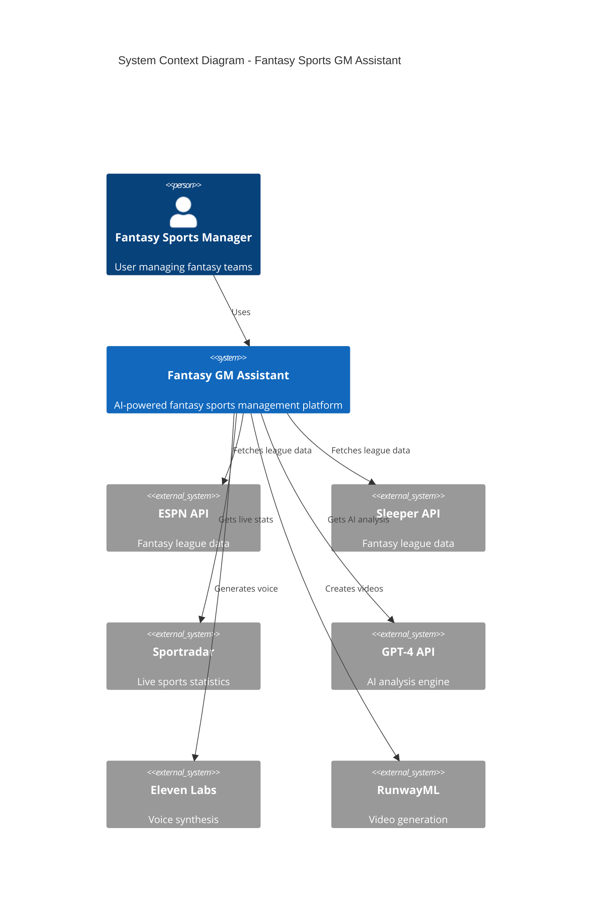
```mermaid
C4Context
    title System Context Diagram - Fantasy Sports GM Assistant

    Person(user, "Fantasy Sports Manager", "User managing fantasy teams")
    System(app, "Fantasy GM Assistant", "AI-powered fantasy sports management platform")
    
    System_Ext(espn, "ESPN API", "Fantasy league data")
    System_Ext(sleeper, "Sleeper API", "Fantasy league data")
    System_Ext(sportradar, "Sportradar", "Live sports statistics")
    System_Ext(openai, "GPT-4 API", "AI analysis engine")
    System_Ext(eleven, "Eleven Labs", "Voice synthesis")
    System_Ext(runway, "RunwayML", "Video generation")
    
    Rel(user, app, "Uses")
    Rel(app, espn, "Fetches league data")
    Rel(app, sleeper, "Fetches league data")
    Rel(app, sportradar, "Gets live stats")
    Rel(app, openai, "Gets AI analysis")
    Rel(app, eleven, "Generates voice")
    Rel(app, runway, "Creates videos")
```

## 2.2 Container Architecture

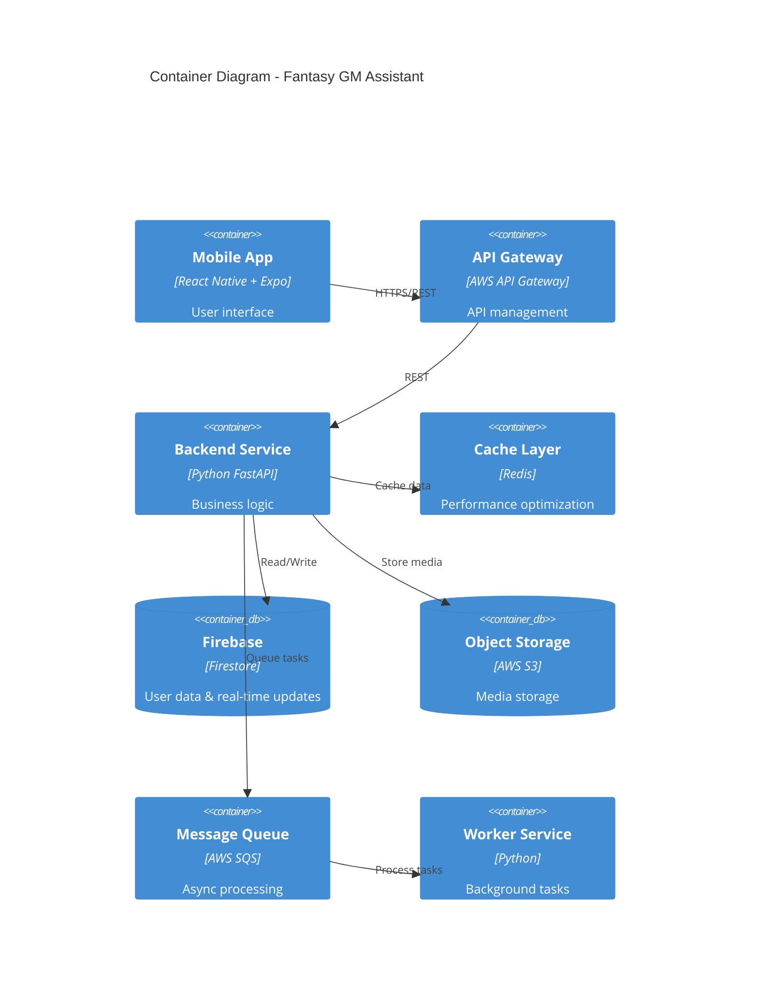
```mermaid
C4Container
    title Container Diagram - Fantasy GM Assistant

    Container(mobile, "Mobile App", "React Native + Expo", "User interface")
    Container(api, "API Gateway", "AWS API Gateway", "API management")
    Container(backend, "Backend Service", "Python FastAPI", "Business logic")
    Container(cache, "Cache Layer", "Redis", "Performance optimization")
    
    ContainerDb(firebase, "Firebase", "Firestore", "User data & real-time updates")
    ContainerDb(s3, "Object Storage", "AWS S3", "Media storage")
    
    Container(queue, "Message Queue", "AWS SQS", "Async processing")
    Container(worker, "Worker Service", "Python", "Background tasks")
    
    Rel(mobile, api, "HTTPS/REST")
    Rel(api, backend, "REST")
    Rel(backend, firebase, "Read/Write")
    Rel(backend, cache, "Cache data")
    Rel(backend, s3, "Store media")
    Rel(backend, queue, "Queue tasks")
    Rel(queue, worker, "Process tasks")
```

## 2.3 Component Details

### 2.3.1 Mobile Application (React Native)

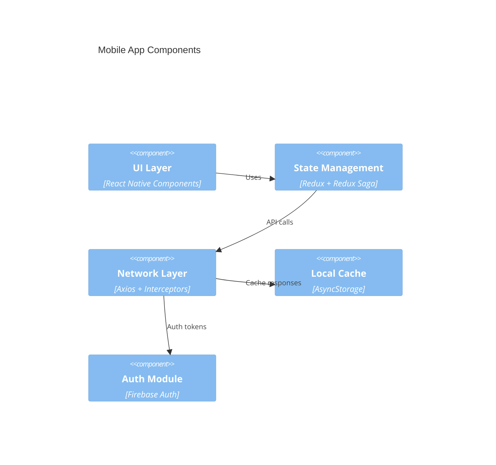
```mermaid
C4Component
    title Mobile App Components

    Component(ui, "UI Layer", "React Native Components")
    Component(state, "State Management", "Redux + Redux Saga")
    Component(network, "Network Layer", "Axios + Interceptors")
    Component(cache, "Local Cache", "AsyncStorage")
    Component(auth, "Auth Module", "Firebase Auth")
    
    Rel(ui, state, "Uses")
    Rel(state, network, "API calls")
    Rel(network, cache, "Cache responses")
    Rel(network, auth, "Auth tokens")
```

### 2.3.2 Backend Service (FastAPI)


```mermaid
C4Component
    title Backend Service Components

    Component(router, "API Router", "FastAPI Routes")
    Component(service, "Service Layer", "Business Logic")
    Component(ml, "ML Engine", "Predictive Analytics")
    Component(integration, "Integration Layer", "External APIs")
    Component(data, "Data Access", "Repository Pattern")
    
    Rel(router, service, "Processes requests")
    Rel(service, ml, "Gets predictions")
    Rel(service, integration, "External data")
    Rel(service, data, "Data access")
```

## 2.4 Data Flow Architecture

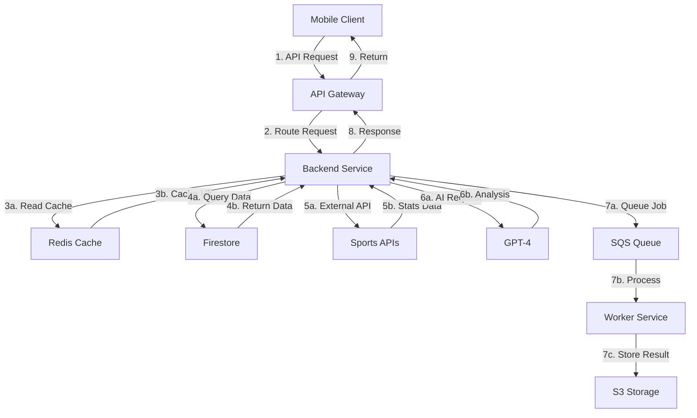
```mermaid
flowchart TD
    A[Mobile Client] -->|1. API Request| B[API Gateway]
    B -->|2. Route Request| C[Backend Service]
    
    C -->|3a. Read Cache| D[Redis Cache]
    D -->|3b. Cache Hit| C
    
    C -->|4a. Query Data| E[Firestore]
    E -->|4b. Return Data| C
    
    C -->|5a. External API| F[Sports APIs]
    F -->|5b. Stats Data| C
    
    C -->|6a. AI Request| G[GPT-4]
    G -->|6b. Analysis| C
    
    C -->|7a. Queue Job| H[SQS Queue]
    H -->|7b. Process| I[Worker Service]
    I -->|7c. Store Result| J[S3 Storage]
    
    C -->|8. Response| B
    B -->|9. Return| A
```

## 2.5 Technical Decisions

### Storage Solutions

| Component | Technology | Justification |
| --- | --- | --- |
| Primary Database | Firebase Firestore | Real-time sync, scalable, managed service |
| Cache Layer | Redis | In-memory performance, pub/sub support |
| Media Storage | AWS S3 | Cost-effective, high durability |
| Message Queue | AWS SQS | Reliable async processing |

### Communication Patterns

| Pattern | Implementation | Use Case |
| --- | --- | --- |
| Synchronous | REST/HTTP | User interactions |
| Asynchronous | WebSocket | Real-time updates |
| Event-Driven | SQS/Redis Pub-Sub | Background processing |
| Batch Processing | Worker Services | Data aggregation |

## 2.6 Cross-Cutting Concerns

### Monitoring Architecture

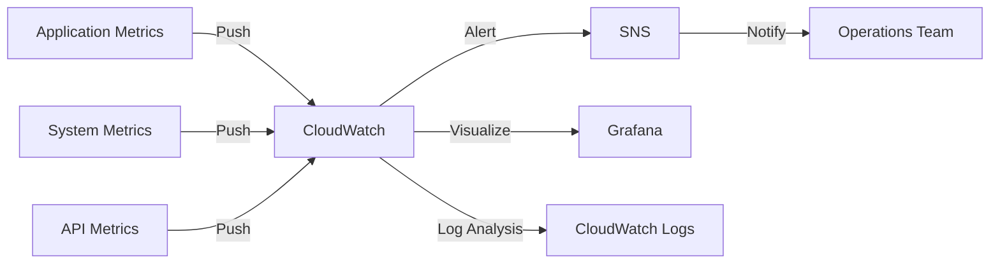
```mermaid
flowchart LR
    A[Application Metrics] -->|Push| B[CloudWatch]
    C[System Metrics] -->|Push| B
    D[API Metrics] -->|Push| B
    
    B -->|Alert| E[SNS]
    E -->|Notify| F[Operations Team]
    
    B -->|Visualize| G[Grafana]
    B -->|Log Analysis| H[CloudWatch Logs]
```

### Security Architecture

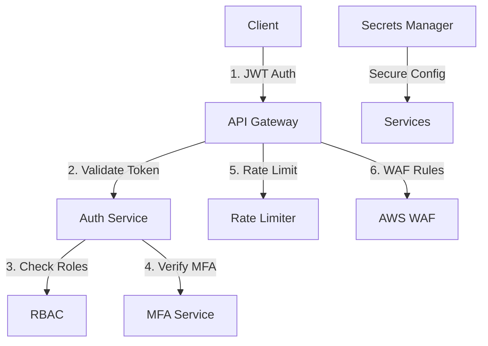
```mermaid
flowchart TD
    A[Client] -->|1. JWT Auth| B[API Gateway]
    B -->|2. Validate Token| C[Auth Service]
    
    C -->|3. Check Roles| D[RBAC]
    C -->|4. Verify MFA| E[MFA Service]
    
    B -->|5. Rate Limit| F[Rate Limiter]
    B -->|6. WAF Rules| G[AWS WAF]
    
    H[Secrets Manager] -->|Secure Config| I[Services]
```

## 2.7 Deployment Architecture

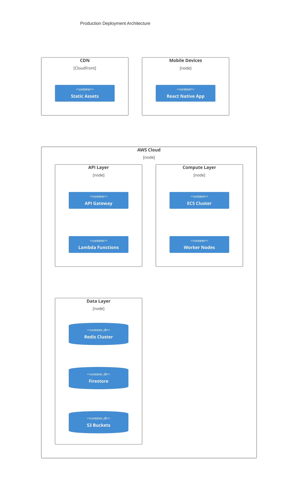
```mermaid
C4Deployment
    title Production Deployment Architecture

    Deployment_Node(cdn, "CDN", "CloudFront"){
        Container(static, "Static Assets")
    }
    
    Deployment_Node(mobile, "Mobile Devices"){
        Container(app, "React Native App")
    }
    
    Deployment_Node(aws, "AWS Cloud"){
        Deployment_Node(api, "API Layer"){
            Container(gateway, "API Gateway")
            Container(lambda, "Lambda Functions")
        }
        
        Deployment_Node(compute, "Compute Layer"){
            Container(ecs, "ECS Cluster")
            Container(workers, "Worker Nodes")
        }
        
        Deployment_Node(data, "Data Layer"){
            ContainerDb(redis, "Redis Cluster")
            ContainerDb(firebase, "Firestore")
            ContainerDb(s3, "S3 Buckets")
        }
    }
```

# 3. SYSTEM COMPONENTS ARCHITECTURE

## 3.1 USER INTERFACE DESIGN

### 3.1.1 Design System Specifications

| Component | Specification | Implementation |
| --- | --- | --- |
| Color Palette | Primary: #1A1A1A (Dark)<br>Secondary: #00FF88 (Neon)<br>Accent: #4A90E2 | React Native StyleSheet |
| Typography | Headers: Inter Bold<br>Body: Inter Regular<br>Monospace: SF Mono | React Native Font Loading |
| Spacing | Base unit: 8px<br>Grid: 4x4 matrix | Custom spacing utility |
| Icons | Line Awesome icon set<br>Custom sports icons | SVG components |
| Dark Mode | System default + manual toggle | React Native Appearance API |
| Accessibility | WCAG 2.1 Level AA | React Native Accessibility API |

### 3.1.2 Component Library

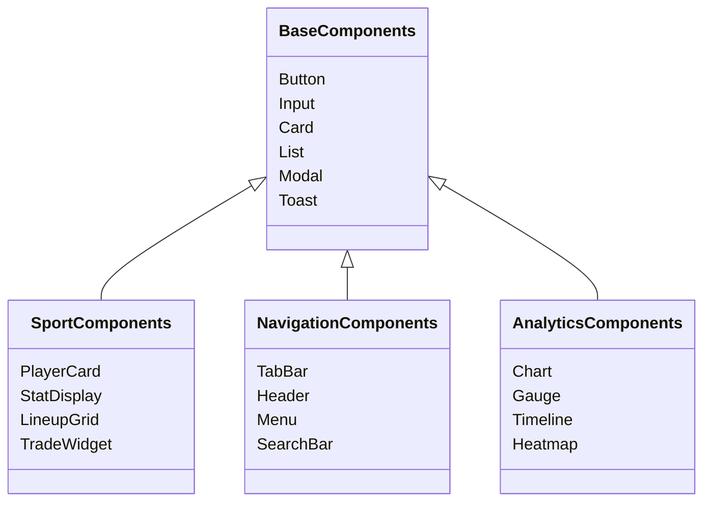
```mermaid
classDiagram
    class BaseComponents {
        Button
        Input
        Card
        List
        Modal
        Toast
    }
    
    class SportComponents {
        PlayerCard
        StatDisplay
        LineupGrid
        TradeWidget
    }
    
    class NavigationComponents {
        TabBar
        Header
        Menu
        SearchBar
    }
    
    class AnalyticsComponents {
        Chart
        Gauge
        Timeline
        Heatmap
    }
    
    BaseComponents <|-- SportComponents
    BaseComponents <|-- NavigationComponents
    BaseComponents <|-- AnalyticsComponents
```

### 3.1.3 Critical User Flows

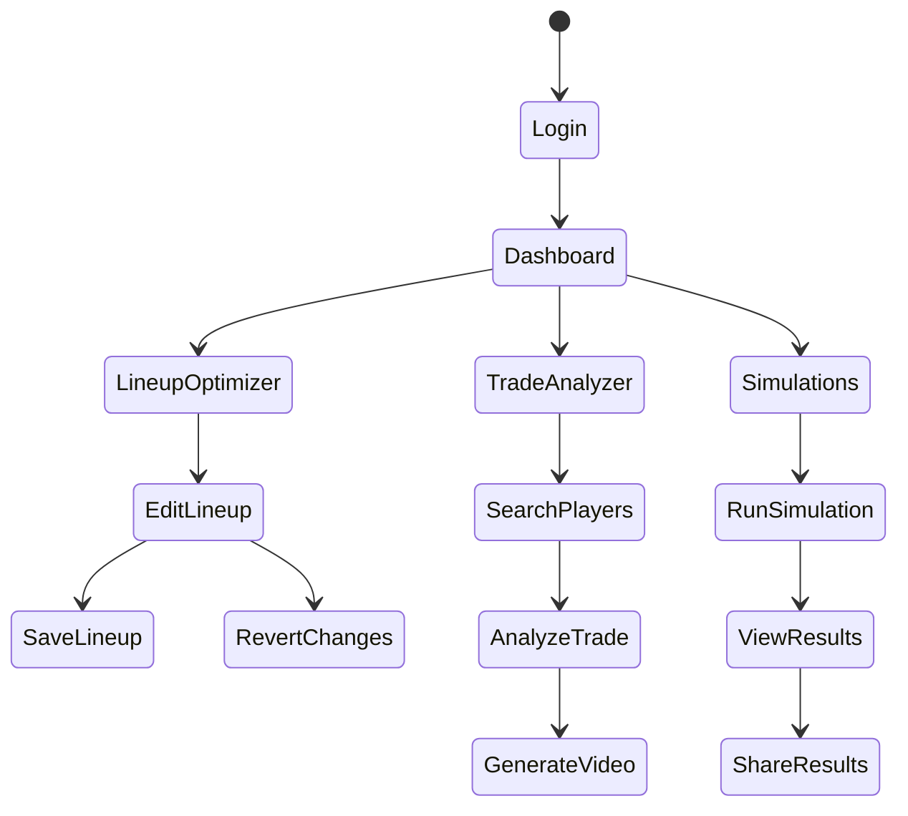
```mermaid
stateDiagram-v2
    [*] --> Login
    Login --> Dashboard
    Dashboard --> LineupOptimizer
    Dashboard --> TradeAnalyzer
    Dashboard --> Simulations
    
    LineupOptimizer --> EditLineup
    EditLineup --> SaveLineup
    EditLineup --> RevertChanges
    
    TradeAnalyzer --> SearchPlayers
    SearchPlayers --> AnalyzeTrade
    AnalyzeTrade --> GenerateVideo
    
    Simulations --> RunSimulation
    RunSimulation --> ViewResults
    ViewResults --> ShareResults
```

## 3.2 DATABASE DESIGN

### 3.2.1 Schema Design

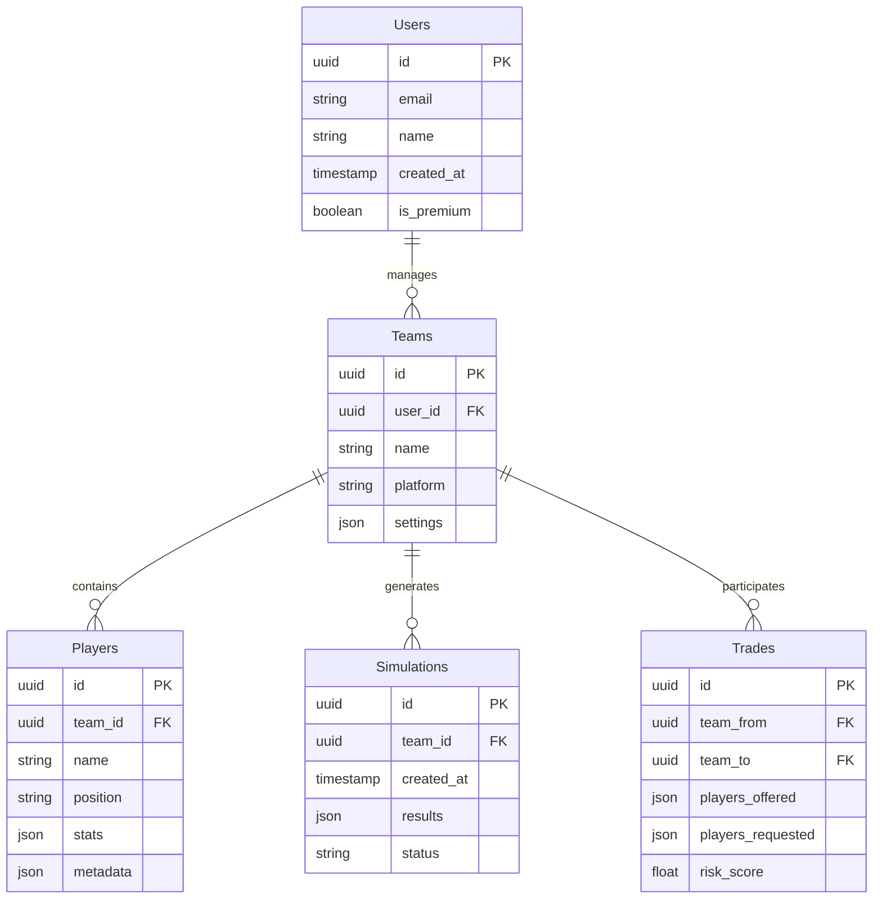
```mermaid
erDiagram
    Users ||--o{ Teams : manages
    Teams ||--o{ Players : contains
    Teams ||--o{ Simulations : generates
    Teams ||--o{ Trades : participates
    
    Users {
        uuid id PK
        string email
        string name
        timestamp created_at
        boolean is_premium
    }
    
    Teams {
        uuid id PK
        uuid user_id FK
        string name
        string platform
        json settings
    }
    
    Players {
        uuid id PK
        uuid team_id FK
        string name
        string position
        json stats
        json metadata
    }
    
    Simulations {
        uuid id PK
        uuid team_id FK
        timestamp created_at
        json results
        string status
    }
    
    Trades {
        uuid id PK
        uuid team_from FK
        uuid team_to FK
        json players_offered
        json players_requested
        float risk_score
    }
```

### 3.2.2 Data Management Strategy

| Aspect | Strategy | Implementation |
| --- | --- | --- |
| Partitioning | By sport type and season | Firestore collections |
| Indexing | Compound indexes on queries | Firestore indexes |
| Caching | Two-layer: Redis + Local | 15-minute TTL |
| Backup | Hourly incremental | AWS S3 |
| Retention | Active: 2 years<br>Archive: 5 years | Automated lifecycle |
| Encryption | AES-256 at rest | Firebase security |

## 3.3 API DESIGN

### 3.3.1 API Architecture

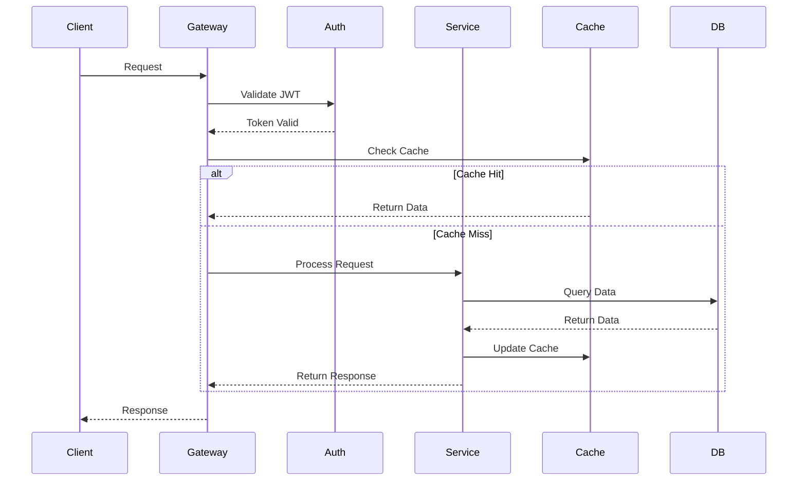
```mermaid
sequenceDiagram
    participant Client
    participant Gateway
    participant Auth
    participant Service
    participant Cache
    participant DB
    
    Client->>Gateway: Request
    Gateway->>Auth: Validate JWT
    Auth-->>Gateway: Token Valid
    Gateway->>Cache: Check Cache
    
    alt Cache Hit
        Cache-->>Gateway: Return Data
    else Cache Miss
        Gateway->>Service: Process Request
        Service->>DB: Query Data
        DB-->>Service: Return Data
        Service->>Cache: Update Cache
        Service-->>Gateway: Return Response
    end
    
    Gateway-->>Client: Response
```

### 3.3.2 API Endpoints

| Endpoint | Method | Purpose | Rate Limit |
| --- | --- | --- | --- |
| `/api/v1/teams` | GET | List user teams | 100/min |
| `/api/v1/players` | GET | Search players | 200/min |
| `/api/v1/trades` | POST | Analyze trade | 50/min |
| `/api/v1/simulations` | POST | Run simulation | 10/min |
| `/api/v1/lineups` | PUT | Update lineup | 100/min |

### 3.3.3 Integration Specifications

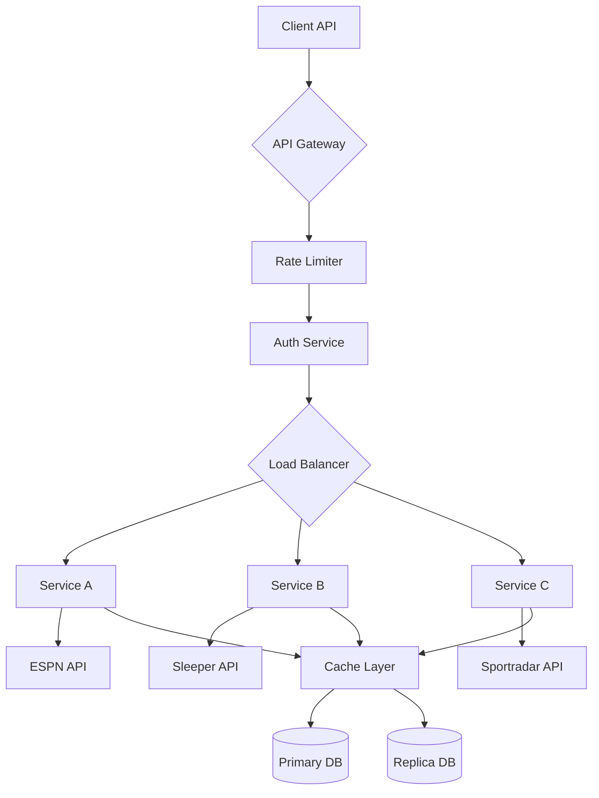
```mermaid
flowchart TD
    A[Client API] --> B{API Gateway}
    B --> C[Rate Limiter]
    C --> D[Auth Service]
    D --> E{Load Balancer}
    
    E --> F[Service A]
    E --> G[Service B]
    E --> H[Service C]
    
    F --> I[ESPN API]
    G --> J[Sleeper API]
    H --> K[Sportradar API]
    
    F --> L[Cache Layer]
    G --> L
    H --> L
    
    L --> M[(Primary DB)]
    L --> N[(Replica DB)]
```

### 3.3.4 Security Controls

| Control | Implementation | Purpose |
| --- | --- | --- |
| Authentication | JWT + OAuth2 | Identity verification |
| Authorization | RBAC | Access control |
| Rate Limiting | Token bucket | Abuse prevention |
| Input Validation | JSON Schema | Data integrity |
| API Versioning | URI versioning | Compatibility |
| SSL/TLS | TLS 1.3 | Transport security |

# 4. TECHNOLOGY STACK

## 4.1 PROGRAMMING LANGUAGES

| Platform/Component | Language | Version | Justification |
| --- | --- | --- | --- |
| Mobile Client | TypeScript | 4.9+ | Type safety, better IDE support for React Native |
| Backend Services | Python | 3.11+ | Async support, ML libraries, FastAPI compatibility |
| Data Processing | Python | 3.11+ | NumPy/Pandas ecosystem for statistics |
| Infrastructure | HCL | 1.5+ | Terraform configuration for AWS |
| Database Queries | SQL | - | Firebase/PostgreSQL compatibility |

## 4.2 FRAMEWORKS & LIBRARIES

### Core Frameworks

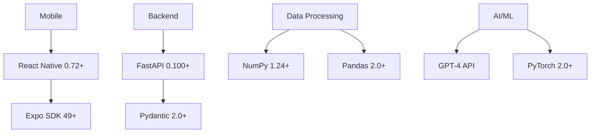
```mermaid
graph TD
    A[Mobile] --> B[React Native 0.72+]
    B --> C[Expo SDK 49+]
    
    D[Backend] --> E[FastAPI 0.100+]
    E --> F[Pydantic 2.0+]
    
    G[Data Processing] --> H[NumPy 1.24+]
    G --> I[Pandas 2.0+]
    
    J[AI/ML] --> K[GPT-4 API]
    J --> L[PyTorch 2.0+]
```

### Supporting Libraries

| Category | Library | Version | Purpose |
| --- | --- | --- | --- |
| State Management | Redux Toolkit | 1.9+ | Centralized state management |
| Navigation | React Navigation | 6.0+ | Mobile app routing |
| Data Visualization | Victory Native | 36.0+ | Statistical charts |
| API Client | Axios | 1.4+ | HTTP requests |
| Testing | Jest | 29.0+ | Unit/Integration testing |
| Video Processing | FFmpeg-python | 0.2+ | Media manipulation |

## 4.3 DATABASES & STORAGE

### Primary Storage Solutions

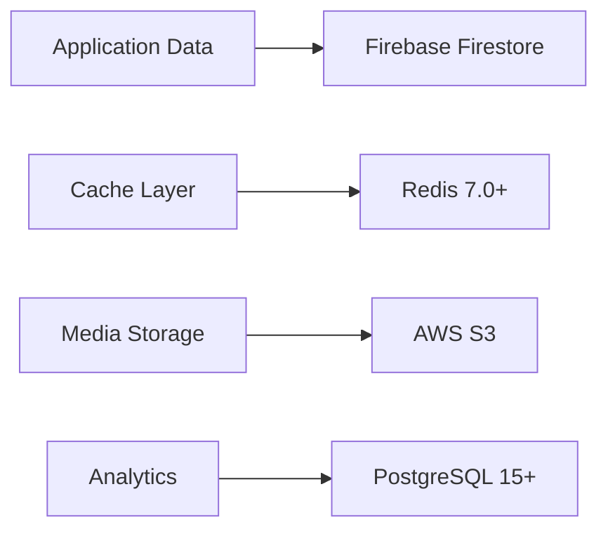
```mermaid
graph LR
    A[Application Data] --> B[Firebase Firestore]
    C[Cache Layer] --> D[Redis 7.0+]
    E[Media Storage] --> F[AWS S3]
    G[Analytics] --> H[PostgreSQL 15+]
```

### Data Persistence Strategy

| Data Type | Storage Solution | Retention Policy |
| --- | --- | --- |
| User Data | Firestore | Indefinite |
| Session Data | Redis | 24 hours |
| Media Files | S3 | 30 days |
| Analytics | PostgreSQL | 2 years |
| Cache | Redis | 1 hour |

## 4.4 THIRD-PARTY SERVICES

### Service Integration Architecture

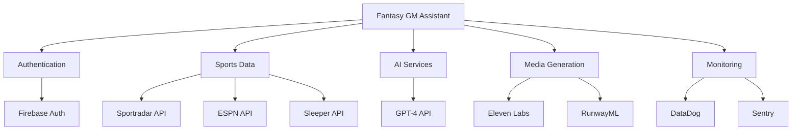
```mermaid
graph TD
    A[Fantasy GM Assistant] --> B[Authentication]
    A --> C[Sports Data]
    A --> D[AI Services]
    A --> E[Media Generation]
    A --> F[Monitoring]
    
    B --> B1[Firebase Auth]
    C --> C1[Sportradar API]
    C --> C2[ESPN API]
    C --> C3[Sleeper API]
    D --> D1[GPT-4 API]
    E --> E1[Eleven Labs]
    E --> E2[RunwayML]
    F --> F1[DataDog]
    F --> F2[Sentry]
```

### Service Dependencies

| Service | Provider | Purpose | SLA |
| --- | --- | --- | --- |
| Authentication | Firebase Auth | User management | 99.95% |
| Sports Data | Sportradar | Live statistics | 99.9% |
| AI Processing | OpenAI | GPT-4 analysis | 99.5% |
| Voice Generation | Eleven Labs | Audio content | 99.0% |
| Video Generation | RunwayML | Visual content | 99.0% |
| Error Tracking | Sentry | Error monitoring | 99.9% |
| Performance | DataDog | System monitoring | 99.9% |

## 4.5 DEVELOPMENT & DEPLOYMENT

### Development Pipeline

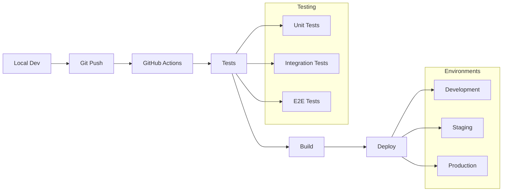
```mermaid
graph LR
    A[Local Dev] --> B[Git Push]
    B --> C[GitHub Actions]
    C --> D[Tests]
    D --> E[Build]
    E --> F[Deploy]
    
    subgraph Testing
    D1[Unit Tests]
    D2[Integration Tests]
    D3[E2E Tests]
    end
    
    subgraph Environments
    F1[Development]
    F2[Staging]
    F3[Production]
    end
    
    D --> D1
    D --> D2
    D --> D3
    F --> F1
    F --> F2
    F --> F3
```

### Build & Deployment Tools

| Category | Tool | Version | Purpose |
| --- | --- | --- | --- |
| Version Control | Git | 2.40+ | Source control |
| CI/CD | GitHub Actions | - | Automation |
| Containerization | Docker | 24.0+ | Container runtime |
| Infrastructure | Terraform | 1.5+ | IaC |
| Package Management | Poetry | 1.5+ | Python dependencies |
| Mobile Builds | EAS Build | 3.0+ | Expo build service |

### Development Environment Requirements

| Component | Specification | Version |
| --- | --- | --- |
| Node.js | LTS | 18.x |
| Python | Production | 3.11+ |
| Docker Desktop | Stable | 24.0+ |
| VS Code | Stable | Latest |
| Xcode | iOS Development | 14+ |
| Android Studio | Android Development | Electric Eel+ |

# 5. SYSTEM DESIGN

## 5.1 USER INTERFACE DESIGN

### 5.1.1 Mobile Navigation Structure

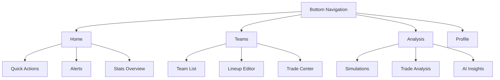
```mermaid
flowchart TD
    A[Bottom Navigation] --> B[Home]
    A --> C[Teams]
    A --> D[Analysis]
    A --> E[Profile]
    
    B --> B1[Quick Actions]
    B --> B2[Alerts]
    B --> B3[Stats Overview]
    
    C --> C1[Team List]
    C --> C2[Lineup Editor]
    C --> C3[Trade Center]
    
    D --> D1[Simulations]
    D --> D2[Trade Analysis]
    D --> D3[AI Insights]
```

### 5.1.2 Screen Components

| Screen | Primary Components | Interaction Elements |
| --- | --- | --- |
| Home Dashboard | - Alert Banner<br>- Quick Action Cards<br>- League Overview | - Pull-to-refresh<br>- Card swipe actions<br>- Action buttons |
| Team Management | - Player Grid<br>- Stats Cards<br>- Position Filters | - Drag-and-drop roster<br>- Player swap<br>- Filter toggles |
| Trade Analysis | - Player Search<br>- Risk Meter<br>- Video Preview | - Multi-select players<br>- Risk slider<br>- Video controls |
| Simulation View | - Monte Carlo Graph<br>- Outcome Table<br>- Share Sheet | - Graph interactions<br>- Export options<br>- Social sharing |

## 5.2 DATABASE DESIGN

### 5.2.1 Data Schema

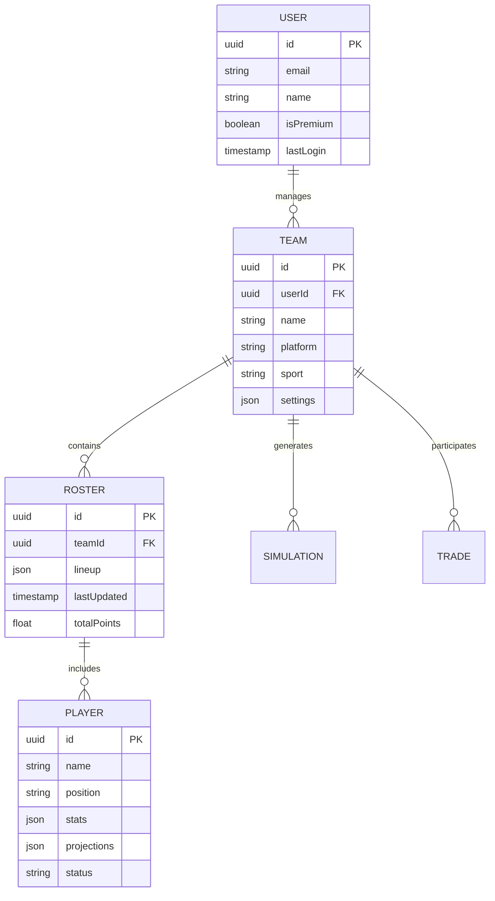
```mermaid
erDiagram
    USER ||--o{ TEAM : manages
    TEAM ||--o{ ROSTER : contains
    ROSTER ||--o{ PLAYER : includes
    TEAM ||--o{ SIMULATION : generates
    TEAM ||--o{ TRADE : participates
    
    USER {
        uuid id PK
        string email
        string name
        boolean isPremium
        timestamp lastLogin
    }
    
    TEAM {
        uuid id PK
        uuid userId FK
        string name
        string platform
        string sport
        json settings
    }
    
    ROSTER {
        uuid id PK
        uuid teamId FK
        json lineup
        timestamp lastUpdated
        float totalPoints
    }
    
    PLAYER {
        uuid id PK
        string name
        string position
        json stats
        json projections
        string status
    }
```

### 5.2.2 Data Storage Strategy

| Data Type | Storage Solution | Access Pattern | Backup Strategy |
| --- | --- | --- | --- |
| User Data | Firestore | Read-heavy, cached | Daily snapshot |
| Game Stats | Redis Cache | High-frequency reads | 15min persistence |
| Media Assets | S3 Buckets | Write-once, read-many | Cross-region replica |
| Analytics | PostgreSQL | Batch processing | Continuous backup |

## 5.3 API DESIGN

### 5.3.1 REST Endpoints

| Endpoint | Method | Purpose | Rate Limit |
| --- | --- | --- | --- |
| `/api/v1/teams` | GET | List user teams | 100/min |
| `/api/v1/players/search` | GET | Search players | 200/min |
| `/api/v1/trades/analyze` | POST | Analyze trade | 50/min |
| `/api/v1/simulations/run` | POST | Run simulation | 20/min |
| `/api/v1/lineups/optimize` | PUT | Update lineup | 100/min |

### 5.3.2 API Flow Architecture

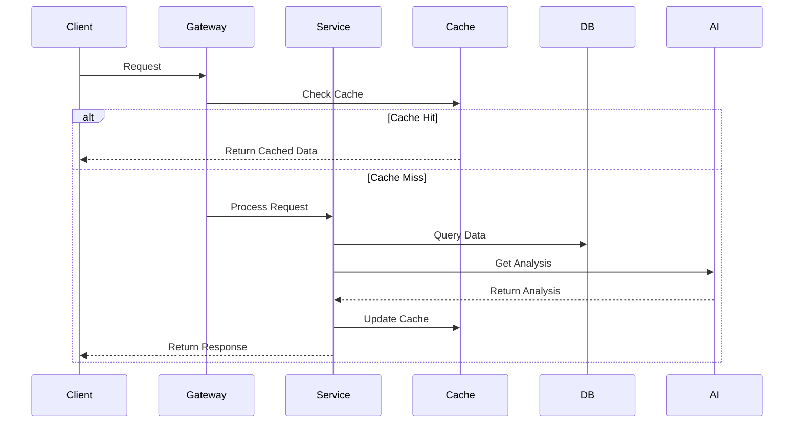
```mermaid
sequenceDiagram
    participant Client
    participant Gateway
    participant Service
    participant Cache
    participant DB
    participant AI
    
    Client->>Gateway: Request
    Gateway->>Cache: Check Cache
    
    alt Cache Hit
        Cache-->>Client: Return Cached Data
    else Cache Miss
        Gateway->>Service: Process Request
        Service->>DB: Query Data
        Service->>AI: Get Analysis
        AI-->>Service: Return Analysis
        Service->>Cache: Update Cache
        Service-->>Client: Return Response
    end
```

### 5.3.3 WebSocket Events

| Event | Direction | Payload | Purpose |
| --- | --- | --- | --- |
| `player.update` | Server→Client | Player Stats | Real-time updates |
| `trade.proposal` | Bi-directional | Trade Details | Trade negotiations |
| `simulation.progress` | Server→Client | Progress % | Long-running sims |
| `lineup.sync` | Bi-directional | Lineup Changes | Cross-device sync |

## 5.4 INTEGRATION ARCHITECTURE

```mermaid
flowchart LR
    A[Mobile Client] --> B{API Gateway}
    B --> C[Auth Service]
    B --> D[Core Service]
    
    D --> E[ESPN API]
    D --> F[Sleeper API]
    D --> G[Sportradar]
    
    D --> H[GPT-4]
    D --> I[Eleven Labs]
    D --> J[RunwayML]
    
    K[(Firestore)] --> D
    L[(Redis)] --> D
    M[(S3)] --> D
```

## 5.5 SECURITY DESIGN

| Security Layer | Implementation | Purpose |
| --- | --- | --- |
| Authentication | Firebase Auth + JWT | Identity verification |
| Authorization | RBAC with custom claims | Access control |
| Data Encryption | AES-256 at rest | Data protection |
| API Security | OAuth 2.0 + Rate limiting | API protection |
| Network Security | AWS WAF + CloudFront | DDoS protection |

## 5.6 MONITORING DESIGN

```mermaid
flowchart TD
    A[Application Metrics] --> B{DataDog}
    C[System Metrics] --> B
    D[User Analytics] --> B
    
    B --> E[Alerts]
    B --> F[Dashboards]
    B --> G[Logs]
    
    E --> H[PagerDuty]
    F --> I[Operations]
    G --> J[ELK Stack]
```

# 6. USER INTERFACE DESIGN

## 6.1 Design System

### Icon Key

```
[?] - Help/Info tooltip
[$] - Premium/Payment feature
[i] - Information
[+] - Add/Create new
[x] - Close/Delete
[<] [>] - Navigation
[^] - Upload/Share
[#] - Dashboard menu
[@] - User profile
[!] - Alert/Warning
[=] - Settings
[*] - Favorite/Important
```

### Input Elements

```
[ ] - Checkbox
( ) - Radio button
[...] - Text input field
[v] - Dropdown menu
[====] - Progress bar
[Button] - Action button
```

## 6.2 Core Screens

### 6.2.1 Login/Registration

```
+----------------------------------------+
|           Fantasy GM Assistant         x|
+----------------------------------------+
|                                        |
|          [@] Login or Register         |
|                                        |
|  Email:                               |
|  [..............................]      |
|                                        |
|  Password:                            |
|  [..............................]      |
|                                        |
|  [    Login with Email    ] [?]        |
|                                        |
|  --------- or continue with --------   |
|                                        |
|  [ Google ] [ ESPN ] [ Sleeper ]       |
|                                        |
|  Don't have an account? [Register]     |
+----------------------------------------+
```

### 6.2.2 Main Dashboard

```
+----------------------------------------+
| [#] Fantasy GM Assistant    [@] [$] [=]|
+----------------------------------------+
| [!] Urgent: K.Murray Out for Week 12   |
+----------------------------------------+
|                                        |
| Quick Actions:                         |
| +------------------+ +----------------+|
| |[*] Optimize      | |[$] Trade      ||
| |    Lineup       | |   Analyzer    ||
| +------------------+ +----------------+|
|                                        |
| Your Teams:                            |
| +-------------------------------------|
| | > Thunder Cats (NFL)  [====] 85%   ||
| | > Hoop Dreams (NBA)   [===] 62%    ||
| | > [+] Add New Team                 ||
| +-------------------------------------|
|                                        |
| Recent AI Analysis:                    |
| +-------------------------------------|
| | [i] Trade recommendation available  ||
| | [i] Lineup changes suggested       ||
| +-------------------------------------|
+----------------------------------------+
```

### 6.2.3 Lineup Optimizer

```
+----------------------------------------+
| [<] Lineup Optimizer         [?] [^]   |
+----------------------------------------+
| Team: Thunder Cats [v]                 |
| Week: 12 [v]                          |
+----------------------------------------+
| Starting Lineup:                       |
|                                        |
| QB  [...J. Allen............] [x]     |
| RB1 [...A. Ekeler..........] [x]     |
| RB2 [...J. Jacobs..........] [x]     |
| WR1 [...J. Jefferson.......] [x]     |
| WR2 [...AJ Brown...........] [x]     |
| TE  [...T. Kelce...........] [x]     |
|                                        |
| AI Suggestions:                        |
| [!] Bench J.Jacobs (Weather warning)  |
| [*] Start D.Pierce (Favorable matchup)|
|                                        |
| [    Apply AI Changes    ] [$]         |
| [    Save Lineup        ]              |
+----------------------------------------+
```

### 6.2.4 Trade Analyzer

```
+----------------------------------------+
| [<] Trade Analyzer          [$] [?]    |
+----------------------------------------+
| Sending:                               |
| [+ Add Player]                         |
| +-------------------------------------|
| | 1. D. Cook (RB)      [x]           ||
| | 2. T. Higgins (WR)   [x]           ||
| +-------------------------------------|
|                                        |
| Receiving:                            |
| [+ Add Player]                         |
| +-------------------------------------|
| | 1. S. Barkley (RB)   [x]           ||
| | 2. D. Smith (WR)     [x]           ||
| +-------------------------------------|
|                                        |
| Risk Assessment: [========--] 80%      |
|                                        |
| AI Analysis:                           |
| [i] Favorable trade (Win probability +15%)|
| [i] Fair value exchange                |
|                                        |
| [    Generate Video    ] [$]           |
| [    Save Analysis     ]               |
+----------------------------------------+
```

### 6.2.5 Simulation Center

```
+----------------------------------------+
| [<] Season Simulator        [$] [?]    |
+----------------------------------------+
| Team: Thunder Cats                     |
|                                        |
| Simulation Parameters:                 |
| Weeks to Simulate: [...8....] [v]      |
| Scenarios:                             |
| [x] Injuries                           |
| [x] Weather                            |
| [x] Matchups                           |
| [ ] Trade Impact                       |
|                                        |
| Results:                               |
| +-------------------------------------|
| | Playoff Odds: 78%                  ||
| | Final Record: 10-4                 ||
| | Points/Week: 122.5                 ||
| +-------------------------------------|
|                                        |
| [    Run New Simulation    ]           |
| [    Export Results    ] [^]           |
+----------------------------------------+
```

## 6.3 Navigation Flow

```mermaid
flowchart TD
    A[Login] --> B[Dashboard]
    B --> C[Lineup Optimizer]
    B --> D[Trade Analyzer]
    B --> E[Simulation Center]
    B --> F[Settings]
    
    C --> G[Save Lineup]
    C --> H[Apply AI Changes]
    
    D --> I[Add Players]
    D --> J[Generate Video]
    
    E --> K[Run Simulation]
    E --> L[Export Results]
```

## 6.4 Responsive Breakpoints

| Device | Width | Layout Adjustments |
| --- | --- | --- |
| Mobile S | 320px | Single column, stacked cards |
| Mobile L | 425px | Single column, larger touch targets |
| Tablet | 768px | Two columns, side navigation |
| Desktop | 1024px+ | Three columns, expanded features |

## 6.5 Component States

| Component | States |
| --- | --- |
| Buttons | Default, Hover, Active, Disabled |
| Inputs | Empty, Focused, Filled, Error |
| Cards | Default, Selected, Loading |
| Alerts | Info, Warning, Error, Success |
| Navigation | Active, Inactive, Hidden |

# 7. SECURITY CONSIDERATIONS

## 7.1 AUTHENTICATION AND AUTHORIZATION

### 7.1.1 Authentication Flow

```mermaid
sequenceDiagram
    participant User
    participant App
    participant Firebase
    participant Backend
    participant OAuth
    
    User->>App: Launch Application
    App->>Firebase: Request Auth
    
    alt Primary Authentication
        Firebase->>OAuth: Redirect to Provider
        OAuth->>User: Present Login UI
        User->>OAuth: Enter Credentials
        OAuth->>Firebase: Return Token
    else MFA Required
        Firebase->>User: Request 2FA Code
        User->>Firebase: Submit Code
    end
    
    Firebase->>Backend: Validate JWT
    Backend->>App: Return Session Token
```

### 7.1.2 Authorization Levels

| Role | Permissions | Access Level |
| --- | --- | --- |
| Free User | - View basic stats<br>- Manual lineup changes<br>- Limited API calls | Basic |
| Premium User | - AI recommendations<br>- Video generation<br>- Unlimited simulations | Full |
| Admin | - User management<br>- System configuration<br>- Analytics access | Administrative |
| API Partner | - Bulk data access<br>- Elevated rate limits<br>- Integration endpoints | Integration |

## 7.2 DATA SECURITY

### 7.2.1 Encryption Strategy

```mermaid
flowchart TD
    A[Data Input] --> B{Classification}
    B -->|PII| C[AES-256 Encryption]
    B -->|Sensitive| D[Field-Level Encryption]
    B -->|Public| E[Standard Storage]
    
    C --> F[Encrypted Storage]
    D --> F
    E --> G[Public Storage]
    
    H[Key Management] --> C
    H --> D
    I[AWS KMS] --> H
```

### 7.2.2 Data Protection Measures

| Data Type | Protection Method | Storage Location |
| --- | --- | --- |
| User Credentials | Argon2 hashing | Firebase Auth |
| Payment Info | PCI DSS compliant | Stripe Vault |
| API Keys | AWS Secrets Manager | EC2 Secure Storage |
| Session Tokens | JWT with 1hr expiry | Redis Cache |
| Fantasy Data | AES-256 encryption | Firestore |
| Media Files | Signed URLs | S3 Bucket |

## 7.3 SECURITY PROTOCOLS

### 7.3.1 Network Security

```mermaid
flowchart LR
    A[Client] -->|TLS 1.3| B[CloudFront]
    B -->|WAF Rules| C[API Gateway]
    C -->|VPC| D[Application Tier]
    D -->|Security Groups| E[Database Tier]
    
    F[DDoS Protection] --> B
    G[Rate Limiting] --> C
    H[IDS/IPS] --> D
```

### 7.3.2 Security Controls

| Control Type | Implementation | Purpose |
| --- | --- | --- |
| Access Control | RBAC + JWT | User permission management |
| Rate Limiting | Token bucket algorithm | Prevent API abuse |
| DDoS Protection | AWS Shield | Network attack prevention |
| WAF | AWS WAF | Web application firewall |
| Monitoring | DataDog + Sentry | Security event detection |
| Compliance | GDPR, CCPA, COPPA | Regulatory compliance |

### 7.3.3 Security Response Plan

```mermaid
stateDiagram-v2
    [*] --> Monitoring
    Monitoring --> Detection: Security Event
    Detection --> Assessment: Trigger Alert
    Assessment --> Response: Threat Confirmed
    Response --> Mitigation: Deploy Fix
    Mitigation --> Recovery: Verify Fix
    Recovery --> Monitoring: Resume Operations
    Assessment --> Monitoring: False Positive
```

### 7.3.4 Security Maintenance

| Task | Frequency | Responsibility |
| --- | --- | --- |
| Security Patches | Weekly | DevOps Team |
| Penetration Testing | Quarterly | Security Team |
| Access Review | Monthly | System Admin |
| Dependency Audit | Weekly | Development Team |
| Backup Verification | Daily | Operations Team |
| Security Training | Quarterly | All Teams |

### 7.3.5 API Security

| Security Layer | Implementation | Description |
| --- | --- | --- |
| Authentication | OAuth 2.0 + JWT | Identity verification |
| Transport | TLS 1.3 | Secure communication |
| Rate Limiting | 100 req/min per user | Prevent abuse |
| Input Validation | JSON Schema | Prevent injection |
| CORS | Whitelist domains | Cross-origin security |
| API Versioning | URI versioning | Maintain compatibility |

# 8. INFRASTRUCTURE

## 8.1 DEPLOYMENT ENVIRONMENT

```mermaid
flowchart TD
    A[Development] --> B[Staging]
    B --> C[Production]
    
    subgraph Development
        D[Local Docker]
        E[Firebase Emulator]
        F[AWS LocalStack]
    end
    
    subgraph Staging
        G[AWS ECS Dev]
        H[Firebase Dev]
        I[Test DBs]
    end
    
    subgraph Production
        J[AWS ECS Prod]
        K[Firebase Prod]
        L[Production DBs]
    end
```

| Environment | Infrastructure | Purpose | Scaling |
| --- | --- | --- | --- |
| Development | Local Docker + Emulators | Local development and testing | N/A |
| Staging | AWS ECS (t3.medium) | Integration testing and QA | Manual |
| Production | AWS ECS (t3.large) | Live application hosting | Auto-scaling |

## 8.2 CLOUD SERVICES

### Primary Services

| Service | Purpose | Configuration |
| --- | --- | --- |
| AWS ECS | Container hosting | t3.large, auto-scaling 2-10 instances |
| AWS S3 | Media storage | Standard tier with lifecycle policies |
| AWS CloudFront | CDN | Edge locations in NA, EU, Asia |
| Firebase | Authentication & Database | Blaze plan with reserved capacity |
| AWS ElastiCache | Redis caching | t3.medium, 2 node cluster |
| AWS Route 53 | DNS management | Geo-routing enabled |

### Monitoring & Security Services

| Service | Purpose | Integration |
| --- | --- | --- |
| AWS CloudWatch | Performance monitoring | Custom metrics + alerts |
| AWS WAF | Web application firewall | Regional rules |
| AWS Shield | DDoS protection | Standard tier |
| AWS KMS | Key management | Automatic rotation |
| AWS CloudTrail | Audit logging | 90-day retention |

## 8.3 CONTAINERIZATION

```mermaid
graph TD
    A[Base Image] --> B[Python 3.11 Slim]
    B --> C[FastAPI App]
    B --> D[Worker Service]
    
    E[Node 18 Alpine] --> F[React Native Build]
    
    subgraph Docker Images
        C
        D
        F
    end
    
    subgraph Volume Mounts
        G[AWS EFS - Media]
        H[AWS EFS - Logs]
    end
    
    C --> G
    D --> G
    C --> H
    D --> H
```

### Container Specifications

| Container | Base Image | Resources | Scaling |
| --- | --- | --- | --- |
| API Service | python:3.11-slim | 2 vCPU, 4GB RAM | 2-10 instances |
| Worker Service | python:3.11-slim | 2 vCPU, 4GB RAM | 1-5 instances |
| Redis Cache | redis:7.0-alpine | 2 vCPU, 4GB RAM | 2 instances |

## 8.4 ORCHESTRATION

```mermaid
flowchart LR
    A[AWS Application Load Balancer] --> B{ECS Cluster}
    B --> C[API Service Tasks]
    B --> D[Worker Service Tasks]
    
    C --> E[(Redis Cache)]
    D --> E
    
    C --> F[(AWS S3)]
    D --> F
    
    G[Auto Scaling] --> B
    H[Task Definitions] --> B
    I[Service Discovery] --> B
```

### ECS Configuration

| Component | Configuration | Auto-scaling Triggers |
| --- | --- | --- |
| API Service | 2-10 tasks, t3.large | CPU \> 70%, Memory \> 80% |
| Worker Service | 1-5 tasks, t3.medium | Queue length \> 1000 |
| Load Balancer | Application LB | N/A |
| Service Discovery | AWS Cloud Map | N/A |

## 8.5 CI/CD PIPELINE

```mermaid
flowchart TD
    A[GitHub Repository] --> B{GitHub Actions}
    B --> C[Build & Test]
    C --> D[Security Scan]
    D --> E{Deploy}
    
    E -->|Dev| F[Development]
    E -->|Staging| G[Staging]
    E -->|Production| H[Production]
    
    I[Quality Gates] --> C
    J[Sonar Cloud] --> D
    K[AWS CodeDeploy] --> E
```

### Pipeline Stages

| Stage | Tools | Actions | Time |
| --- | --- | --- | --- |
| Build | GitHub Actions | Code compilation, dependency installation | 5 min |
| Test | Jest, Pytest | Unit tests, integration tests | 10 min |
| Security | Snyk, OWASP | Vulnerability scanning, dependency checks | 8 min |
| Quality | SonarCloud | Code quality analysis, coverage reports | 7 min |
| Deploy | AWS CodeDeploy | Blue-green deployment | 15 min |

### Deployment Strategy

| Environment | Strategy | Rollback | Approval |
| --- | --- | --- | --- |
| Development | Direct deploy | Manual | Automated |
| Staging | Blue-green | Automated | Tech Lead |
| Production | Blue-green | Automated | Product Owner |

# APPENDICES

## A.1 ADDITIONAL TECHNICAL INFORMATION

### A.1.1 AI Model Specifications

| Model | Purpose | Context Window | Cost/1K Tokens |
| --- | --- | --- | --- |
| GPT-4 Turbo | Trade Analysis | 128k tokens | $0.01 |
| GPT-4 Vision | Player Video Analysis | 128k tokens | $0.03 |
| Custom ML Models | Monte Carlo Simulations | N/A | Self-hosted |

### A.1.2 Data Processing Pipeline

```mermaid
flowchart TD
    A[Raw Sports Data] --> B{Data Ingestion}
    B --> C[Data Cleaning]
    C --> D[Feature Engineering]
    
    D --> E[ML Processing]
    D --> F[Statistical Analysis]
    
    E --> G[AI Predictions]
    F --> H[Performance Metrics]
    
    G --> I[User Recommendations]
    H --> I
    
    I --> J[Content Generation]
    J --> K[Video Synthesis]
    J --> L[Text Analysis]
```

### A.1.3 Cache Strategy

| Data Type | TTL | Update Trigger |
| --- | --- | --- |
| Player Stats | 15 minutes | On game events |
| Weather Data | 1 hour | On significant changes |
| Trade Analysis | 24 hours | On market changes |
| Video Content | 7 days | On regeneration |

## A.2 GLOSSARY

| Term | Definition |
| --- | --- |
| Monte Carlo Simulation | Statistical method using repeated random sampling to obtain numerical results |
| Feature Engineering | Process of selecting and transforming variables for ML models |
| Token Bucket Algorithm | Rate limiting implementation that controls API request flow |
| Blue-Green Deployment | Deployment strategy using two identical production environments |
| Webhook | HTTP callback that occurs when specific events happen |
| Circuit Breaker | Design pattern that prevents cascading failures in distributed systems |
| Hot Reload | Development feature that updates code changes without full restart |
| Idempotency | Property where an operation produces the same result regardless of repetition |
| Sharding | Database partitioning that separates large databases into smaller parts |
| Time-To-Live (TTL) | Duration for which data remains valid in cache |

## A.3 ACRONYMS

| Acronym | Definition |
| --- | --- |
| API | Application Programming Interface |
| AWS | Amazon Web Services |
| CDN | Content Delivery Network |
| CORS | Cross-Origin Resource Sharing |
| DDoS | Distributed Denial of Service |
| ECS | Elastic Container Service |
| ETL | Extract, Transform, Load |
| GDPR | General Data Protection Regulation |
| JWT | JSON Web Token |
| KMS | Key Management Service |
| MFA | Multi-Factor Authentication |
| MTBF | Mean Time Between Failures |
| MTTR | Mean Time To Recovery |
| OAuth | Open Authorization |
| PII | Personally Identifiable Information |
| RBAC | Role-Based Access Control |
| REST | Representational State Transfer |
| SDK | Software Development Kit |
| SLA | Service Level Agreement |
| SSL | Secure Sockets Layer |
| TLS | Transport Layer Security |
| URI | Uniform Resource Identifier |
| WAF | Web Application Firewall |
| WCAG | Web Content Accessibility Guidelines |
| XSS | Cross-Site Scripting |

## A.4 DEVELOPMENT ENVIRONMENT SETUP

```mermaid
flowchart LR
    A[Local Development] --> B{Development Tools}
    B --> C[VS Code + Extensions]
    B --> D[Node.js v18+]
    B --> E[Python 3.11+]
    B --> F[Docker Desktop]
    
    G[Version Control] --> H{Git Flow}
    H --> I[Feature Branches]
    H --> J[Development]
    H --> K[Staging]
    H --> L[Production]
    
    M[CI/CD Pipeline] --> N{GitHub Actions}
    N --> O[Build]
    N --> P[Test]
    N --> Q[Deploy]
```

## A.5 ERROR CODES AND HANDLING

| Code Range | Category | Handling Strategy |
| --- | --- | --- |
| 1000-1999 | Authentication | Redirect to login |
| 2000-2999 | Authorization | Display permission error |
| 3000-3999 | Validation | Show field-specific errors |
| 4000-4999 | API Limits | Implement exponential backoff |
| 5000-5999 | System Errors | Retry with circuit breaker |
| 6000-6999 | Integration | Fallback to cached data |

## A.6 TESTING STRATEGY

```mermaid
flowchart TD
    A[Testing Pyramid] --> B[E2E Tests]
    A --> C[Integration Tests]
    A --> D[Unit Tests]
    
    B --> E[Cypress]
    C --> F[Jest]
    D --> G[PyTest]
    
    H[Test Types] --> I[Functional]
    H --> J[Performance]
    H --> K[Security]
    H --> L[Accessibility]
    
    M[CI Integration] --> N[Pre-commit]
    M --> O[Pull Request]
    M --> P[Deployment]
```